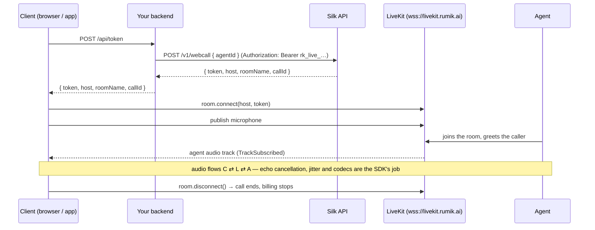
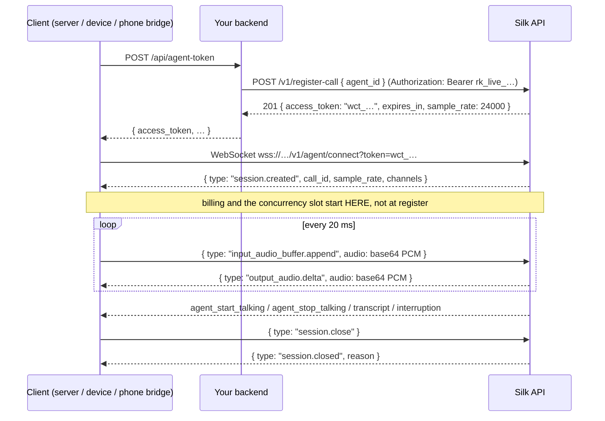

# Architecture

Every cookbook in this repository is the same three-step story. Only the client and the transport change.

```
 ┌──────────────┐   1. "start a call"    ┌──────────────────┐   2. API key + agent id   ┌─────────────────┐
 │    client    │ ─────────────────────▶ │   your backend   │ ────────────────────────▶ │   Silk API      │
 │ (web/mobile/ │                        │ (Node / Python / │                           │ silk-api.rumik  │
 │  phone/edge) │ ◀───────────────────── │  anything)       │ ◀──────────────────────── │      .ai        │
 └──────┬───────┘   short-lived cred     └──────────────────┘   { token | access_token } └────────┬────────┘
        │                                                                                         │
        │ 3. client connects with the credential — media flows directly, never through your backend
        └─────────────────────────────────────────────────────────────────────────────────────────┘
```

The API key never leaves your backend. The client receives something that is short-lived, scoped to one call, and worthless after it is used.

## Transport A — WebRTC (LiveKit)

Used by the web, React Native, Flutter, iOS and Android cookbooks.



What the client is responsible for:

- attaching the agent's audio track to an output (an `<audio>` element on the web, the platform audio session on mobile);
- enabling the microphone;
- turning "who is speaking" into UI state (see barge-in below).

What the client is **not** responsible for: sample rates, codecs, echo, packet loss.

### Agent state over WebRTC

If the agent participant publishes the LiveKit `lk.agent.state` attribute (`listening` / `thinking` / `speaking`), the `useVoiceAssistant()` hook and its equivalents read it directly. Every cookbook also falls back to active-speaker detection so that state still works if the attribute is absent:

| signal | UI state |
| --- | --- |
| agent is an active speaker | `speaking` (red) |
| local participant is an active speaker while the agent is `speaking` | `interrupting` (green) — barge-in |
| neither | `listening` (grey) |
| `lk.agent.state == thinking` | `thinking` (amber) |

## Transport B — WebSocket (realtime socket)

Used by the Python, Node.js and telephony cookbooks.



When your backend *is* the client (server-to-server), collapse steps 1–3: register and connect from the same process.

What the client is responsible for:

- delivering **PCM signed 16-bit little-endian, mono, 24 000 Hz**, ideally in 20 ms frames (480 samples = 960 bytes);
- resampling anything that is not 24 kHz (telephony is 8 kHz μ-law, most USB mics are 44.1/48 kHz);
- playing `output_audio.delta` frames back-to-back, and **flushing the playback buffer on `interruption`** — otherwise the caller hears the agent finish a sentence it has already abandoned;
- not sending audio before `session.created`.

## Barge-in, side by side

| | WebRTC | WebSocket |
| --- | --- | --- |
| who stops the agent's speech | the agent, server-side | the agent, server-side |
| how the client finds out | local participant becomes an active speaker while the agent is speaking; `lk.agent.state` flips back to `listening` | explicit `{ "type": "interruption" }` event, followed by `agent_stop_talking` |
| what the client must do | nothing for audio; update the UI | **drop any buffered `output_audio.delta` not yet played**, then update the UI |
| what the demos show | visualizer turns from red to green | visualizer turns from red to green, playback queue length drops to zero |

## Where the call shows up

Both transports return a call id (`callId` on `/v1/webcall`, `call_id` in `session.created`). It is the key into **conversations** in the dashboard, where the transcript and recording appear shortly after the call ends. Store it next to your own user/session record if you want to correlate later.
